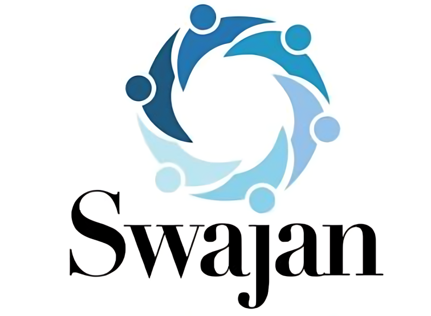

# 🚩 SWAJAN (સ્વજન) - Heritage Community Mobile App

<p align="center">
  
</p>

<p align="center">
  <b>Connecting Community, Heritage, Culture, and Growth</b><br>
  A modern, high-performance Flutter mobile application tailored for community engagement, member directory, job vacancies, business promotions, and social donations.
</p>

<p align="center">
  
  
  
  
  
</p>

---

## 🌟 Overview

**SWAJAN** is a feature-rich, community-focused mobile app designed to bring families, professionals, businesses, and social causes under one unified digital platform. Built with Flutter and Material 3 design principles, it delivers a smooth, intuitive, and responsive user experience in both **English** and **Gujarati (ગુજરાતી)**.

---

## ✨ Key Features & Modules

### 🌐 1. Dynamic Dual-Language Support (English & Gujarati)
- Seamless real-time language switching across all screens.
- Auto-translates member profiles, news, category cards, and navigation drawer options.

### 💼 2. Job Portal & Career Opportunities
- **Post Job Vacancies**: Employers can upload company logos/banners, required qualifications, key skills, experience criteria, and contact person details.
- **Candidate Application & Resume Upload**: Candidates can apply with one-click local storage CV/Resume upload (`PDF`, `DOCX`).
- **Live Feed Sync**: Newly posted job vacancies instantly sync to the Home Screen community feed.

### 🔒 3. Business Promotions & Admin Approval Tag
- Business & marketing vacancies carry a `🔒 ADMIN APPROVAL & SPONSORED PROMOTION` badge.
- **Payment Gateway Modal**: Integrated Razorpay/UPI/Card promotion fee system (₹499) for featured marketing posts.

### 🕊️ 4. Donations & Social Causes
- Explore community donation campaigns (Mandir development, education funds, medical relief).
- Transparent checkout flow with preset donation amounts, receipt details, and Gujarati translation support.

### 👥 5. Member Directory & Family Tree
- Searchable community member directory with profession, location, and contact filtering.
- Visual family tree connections and member profile cards.

### 🕯️ 6. Obituary & Tributes (શ્રદ્ધાંજલિ)
- Community obituary notifications with virtual tribute counting and tribute message postings.

### 💒 7. Samuhik Vivah & Real Estate Marketplace
- Mass wedding couple registration & event guidelines.
- Property buy/sell/rent marketplace for community members.

---

## 🏗️ Project Architecture & Folder Structure

```text
Heritage App/
├── assets/
│   ├── images/              # Logo, badges, banners, and placeholders
│   └── videos/              # Splash video animations
├── lib/
│   ├── main.dart            # App entry point & Theme configuration
│   ├── providers/
│   │   └── language_provider.dart  # Global state & localization engine
│   ├── screens/
│   │   ├── home_screen.dart             # Main dashboard & live feed
│   │   ├── jobs_screen.dart             # Job portal & vacancy posting
│   │   ├── donation_causes_screen.dart   # Social donation campaigns
│   │   ├── donation_checkout_screen.dart # Payment checkout screen
│   │   ├── member_directory_screen.dart  # Member list & filter
│   │   ├── profile_screen.dart           # User profile & family tree
│   │   ├── edit_profile_screen.dart      # Edit user profile details
│   │   ├── obituary_screen.dart         # Shradhanjali tributes
│   │   ├── property_screen.dart         # Real estate listings
│   │   └── splash_video_screen.dart     # Brand launch splash video
│   ├── services/
│   │   └── translation_service.dart     # English to Gujarati dictionary
│   └── widgets/
│       └── custom_bottom_navbar.dart    # Adaptive bottom navigation bar
├── pubspec.yaml             # Dependencies & asset configuration
└── README.md                # Project documentation
```

---

## ⚡ Getting Started & Setup

### Prerequisites
- [Flutter SDK](https://docs.flutter.dev/get-started/install) (v3.19.0 or higher)
- [Dart SDK](https://dart.dev/get-dart) (v3.0.0 or higher)
- Android Studio / VS Code with Flutter extension
- An Android Emulator or physical device

### Installation Steps

1. **Clone the Repository**
   ```bash
   git clone https://github.com/Sejal-rai-1608/Heritage-App.git
   cd Heritage-App
   ```

2. **Install Dependencies**
   ```bash
   flutter pub get
   ```

3. **Check Code Analysis**
   ```bash
   flutter analyze
   ```

4. **Run the Application**
   ```bash
   flutter run
   ```

---

## 🤝 Contributing

Contributions are welcome! Please follow these steps:
1. Fork the Project Repository.
2. Create your Feature Branch (`git checkout -b feature/AmazingFeature`).
3. Commit your Changes (`git commit -m 'feat: Add some AmazingFeature'`).
4. Push to the Branch (`git push origin feature/AmazingFeature`).
5. Open a Pull Request.

---

## 📝 License

Distributed under the MIT License. See `LICENSE` for more information.

<p align="center">
  Crafted with ❤️ for the <b>SWAJAN Community</b>
</p>
